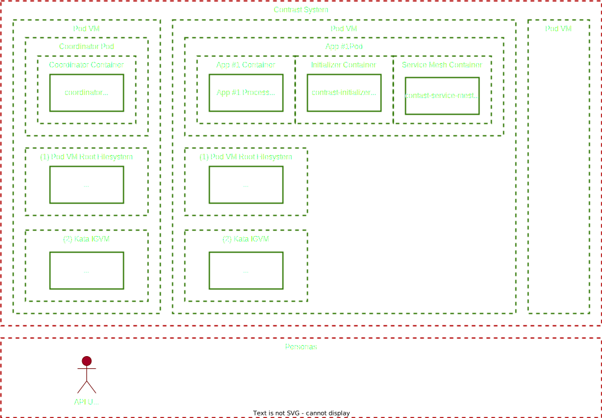
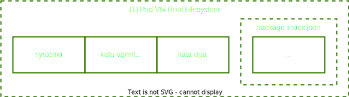
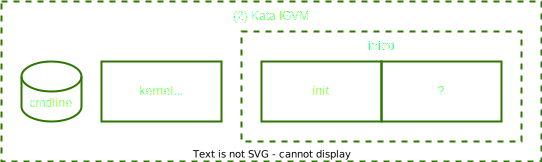

# Running Contrast System

## Personas

* API User

## (1) Pod VM Root Filesystem

* Maintainers: Microsoft (upstream: CoCoCo + Kata)
* package-index.json: 97 *.rpm - does the kata-agent really need this much support ?

## (2) Kata IGVM

* Maintainers: Microsoft
* initrd: what else is included into the initramfs ?

